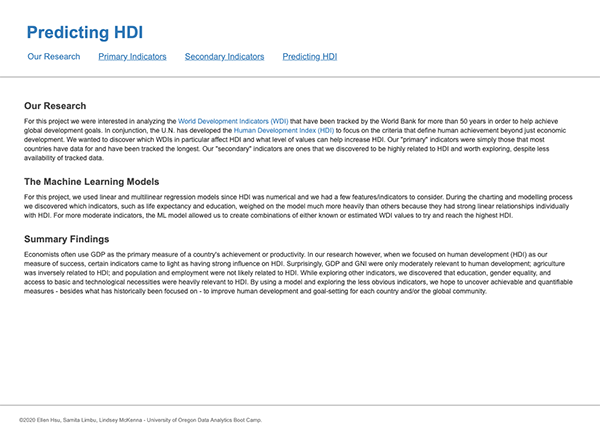
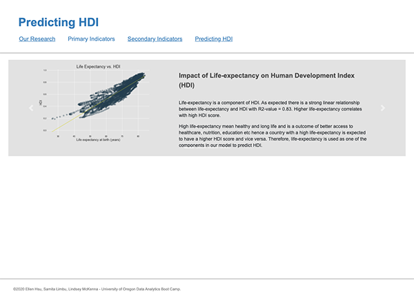
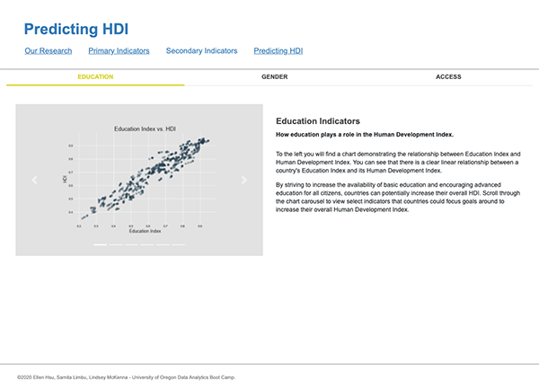
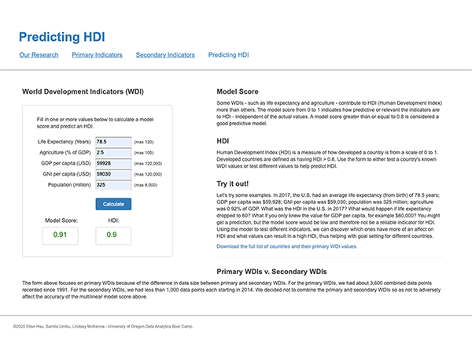

# Predicting the Human Development Index
by Ellen Hsu, Samita Limbu, and Lindsey McKenna

## Live Website
[**Predict HDI on Heroku**](https://predict-hdi.herokuapp.com/)

## Project Summary
For this project we were interested in analyzing the [World Development Indicators (WDI)](http://datatopics.worldbank.org/world-development-indicators/) that have been tracked by the World Bank for more than 50 years in order to help achieve global development goals. In conjunction, the U.N. has developed the [Human Development Index (HDI)](http://hdr.undp.org/en/data#) to focus human achievement beyond just economic development. We wanted to discover which WDIs, in particular, affect HDI and what WDI values can increase HDI. We charted individual WDIs and created a form that allows a user to enter any number of WDI values. The form then calculates a machine learning model score and a predicted HDI value.

### Machine Learning
We primarily used a multilinear regression model because HDI was numerical (as opposed to categorical) and we had a few features/indicators to consider. Some WDIs weighed more heavily in the model than others because they had strong linear relationships to HDI. For more moderately weighted WDIs, the model allowed us to combine WDIs to discover the most predictive combination and to calculate HDI based on known or estimated values.

### Data Sets
1. [World Development Indicators](http://datatopics.worldbank.org/world-development-indicators/)
 If you decide to git clone the project and run the notebook [Predict_HDI.ipynb](https://github.com/linmck/finalproject/blob/master/Predict_HDI.ipynb), please download the [original bulk CSV](http://databank.worldbank.org/data/download/WDI_csv.zip) from Bulk Downloads and extract the file 'WDIData.csv' to the [resources](https://github.com/linmck/finalproject/tree/master/resources) folder. In order to save storage capacity we chose not to upload this file to GitHub since it is ~198MB. 

2. [Human Development Index](http://hdr.undp.org/en/data#)
 From this page, we downloaded the data from Dimensions: 
    - "Human Development Index (HDI)"
    - "Education > Education Index"
    - "Gender > Gender Inequality Index (GII)"
    - Plus several other [secondary indicators](https://predict-hdi.herokuapp.com/secondary) 

### Project Stack
- Data Processing - Python Pandas
- Machine Learning - SciKit Learn
- Visualizations - Matplotlib
- Publication - Flask App hosted on Heroku

### Duration
2 weeks
<<<<<<< HEAD

### Screenshots
<kbd></kbd><kbd></kbd> 
<kbd></kbd><kbd></kbd> 
=======
>>>>>>> bcf2ea2fd86cf9b734ba0fd5d7ebad5f2702638b
