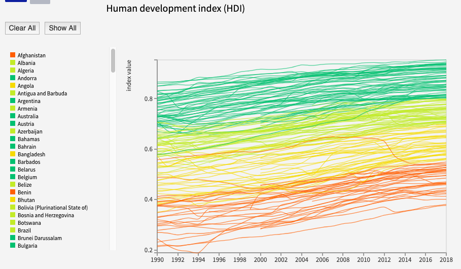
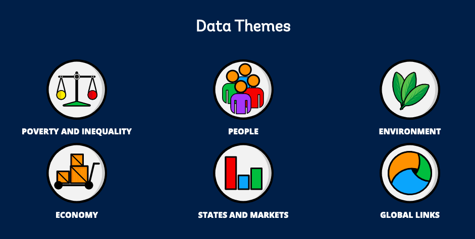

# Predicting the Human Developent Index
by Ellen Hsu, Samita Limbu, and Lindsey McKenna

## Project Topic
Can we predict the development trajectory of a country (as measured by HDI) based on the World Development Indicators surveyed by The World Bank?

## Rationale 
We are interested in exploring the Sustainable Development Goals set forth by The World Bank that they would like to achieve by 2030. These goals are measured by several [World Development Indicators](http://datatopics.worldbank.org/world-development-indicators/). We will select several indicators the help predict the development of a country as measured by the [Human Development Index](http://hdr.undp.org/en/data#). The Human Development Index is a comprehensive measure of the development of a country that takes into account factors other than just GDP such as health, education, infrastructure, etc. 
 

## Data Sets
- [World Development Indicators](http://datatopics.worldbank.org/world-development-indicators/)
- [Human Development Index](http://hdr.undp.org/en/data#)

## Project Stack
- Data Processing - Python Pandas
- Machine Learning - SciKit Learn
- Visualizations - Matplotlib
- Publication - Flask App hosted on Heroku

## Project Goals
We will present our findings in a dashboard of pre-made charts and the user can select various indicators. Our data set is very robust so, through Machine Learning, we will find the top indicators that are the most predictive of HDI. 

 

